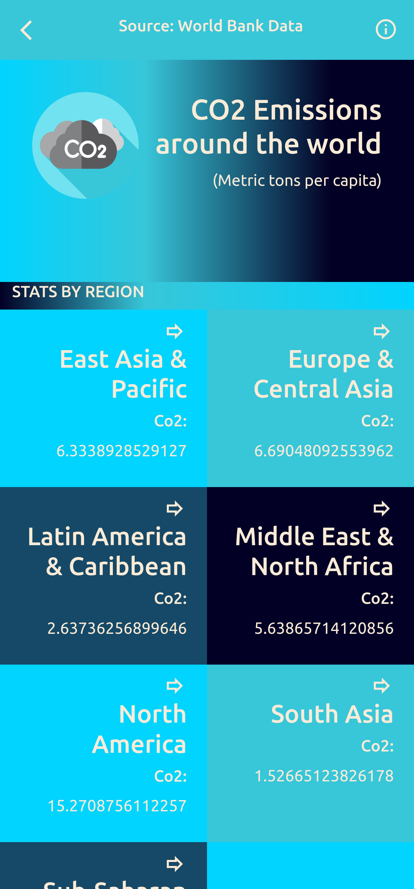

# Co2 Emissions Web App

Carbon dioxide emissions are the primary driver of global climate change. To create awareness about the problem, this project fetches World Bank's data related to Co2 Emissions per capita and shows the data in an accessible way.

This project was bootstrapped with [Create React App](https://github.com/facebook/create-react-app). Design is based on an original idea by [Nelson Sakwa on Behance](https://www.behance.net/sakwadesignstudio).

## About 

Carbon dioxide emissions are the primary driver of global climate change. It’s widely recognised that to avoid the worst impacts of climate change, the world needs to urgently reduce emissions.

## Screenshots

### Home

### Countries 

### Details

## Built with

- HTML/CSS
- Bootstrap 5
- React & Redux
- Jest
- Git Flow
- World Bank Data's API
- VS Code

## Live Demo and presentation

[Live Demo Link](https://nervous-sinoussi-04e1da.netlify.app)

[Presentation](https://www.loom.com/share/85cfa27e95f943d2a8b8ea432fd541a4)

## Getting started

Follow the instructions to get a local copy and run the project on your own server.

You will need:

- Node.js (npm)
- A code editor
- Git

### Setup

1. Open the terminal and clone the project using `git clone REPOURL` 

### Install

1. `cd` into the project folder and run `npm install`
2. Run the command `npm start` to open a local version of the project.

## Test Environment

The test environment is set up with jest. Run `npm test` or `npm test:watch` to run tests.

## Available Scripts

In the project directory, you can run:

### `npm start`

Runs the app in the development mode.\
Open [http://localhost:3000](http://localhost:3000) to view it in your browser.

The page will reload when you make changes.\
You may also see any lint errors in the console.

### `npm test`

Launches the test runner in the interactive watch mode.\
See the section about [running tests](https://facebook.github.io/create-react-app/docs/running-tests) for more information.

### `npm run build`

Builds the app for production to the `build` folder.\
It correctly bundles React in production mode and optimizes the build for the best performance.

The build is minified and the filenames include the hashes.\
Your app is ready to be deployed!

See the section about [deployment](https://facebook.github.io/create-react-app/docs/deployment) for more information.

### `npm run eject`

**Note: this is a one-way operation. Once you `eject`, you can't go back!**

If you aren't satisfied with the build tool and configuration choices, you can `eject` at any time. This command will remove the single build dependency from your project.

Instead, it will copy all the configuration files and the transitive dependencies (webpack, Babel, ESLint, etc) right into your project so you have full control over them. All of the commands except `eject` will still work, but they will point to the copied scripts so you can tweak them. At this point you're on your own.

You don't have to ever use `eject`. The curated feature set is suitable for small and middle deployments, and you shouldn't feel obligated to use this feature. However we understand that this tool wouldn't be useful if you couldn't customize it when you are ready for it.

## Author

👤 **J.P**

- GitHub: [@Maclenn77](https://github.com/Maclenn77)
- Twitter: [@SrJuanPapas](https://twitter.com/SrJuanPapas)
- LinkedIn: [LinkedIn](https://www.linkedin.com/in/juanpaulopereztejada/)

## 🤝 Contributing

Contributions, issues, and feature requests are welcome!

Feel free to check the [issues page](https://github.com/Maclenn77/co2-emissions-app/issues).

### Priority tasks

Do you want to contribute but you don't know how? These are some tasks that are needed in the project:

- Create more tests
- Integrate new APIs
- Allow visualization whit params in a link 

## Show your support

Give a ⭐️ if you like this project!

## 📝 License

This project is [MIT](./MIT.md) licensed.
